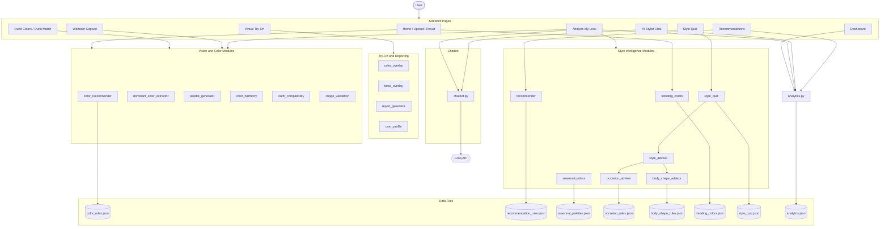

# System Architecture

```mermaid
flowchart TD
    USER([User]) --> UI

    subgraph UI[Streamlit Pages]
        P1[Home / Upload / Result]
        P2[Outfit Colors / Outfit Match]
        P3[Recommendations]
        P4[Webcam Capture]
        P5[Analyze My Look]
        P6[Virtual Try-On]
        P7[AI Stylist Chat]
        P8[Style Quiz]
        P9[Dashboard]
    end

    subgraph VISION[Vision and Color Modules]
        V1[color_recommender]
        V2[dominant_color_extractor]
        V3[palette_generator]
        V4[color_harmony]
        V5[outfit_compatibility]
        V6[image_validation]
    end

    subgraph STYLE[Style Intelligence Modules]
        S1[recommender]
        S2[seasonal_colors]
        S3[occasion_advisor]
        S4[body_shape_advisor]
        S5[trending_colors]
        S6[style_quiz]
        S7[style_advisor]
    end

    subgraph TRYON[Try-On and Reporting]
        T1[color_overlay]
        T2[torso_overlay]
        T3[report_generator]
        T4[user_profile]
    end

    subgraph CHAT[Chatbot]
        C1[chatbot.py]
    end

    subgraph DATA[Data Files]
        D1[(color_rules.json)]
        D2[(recommendation_rules.json)]
        D3[(seasonal_palettes.json)]
        D4[(occasion_rules.json)]
        D5[(body_shape_rules.json)]
        D6[(trending_colors.json)]
        D7[(style_quiz.json)]
        D8[(analytics.json)]
    end

    ANA[analytics.py]
    GROQ{{Groq API}}

    P1 --> VISION
    P1 --> S5
    P2 --> VISION
    P3 --> S1
    P4 --> VISION
    P5 --> VISION
    P5 --> STYLE
    P5 --> C1
    P6 --> TRYON
    P7 --> C1
    P8 --> S6
    P9 --> ANA

    S7 --> S3
    S7 --> S4
    S6 --> S7
    C1 --> GROQ
    P5 --> ANA
    P7 --> ANA
    P3 --> ANA

    V1 --> D1
    S1 --> D2
    S2 --> D3
    S3 --> D4
    S4 --> D5
    S5 --> D6
    S6 --> D7
    ANA --> D8
```